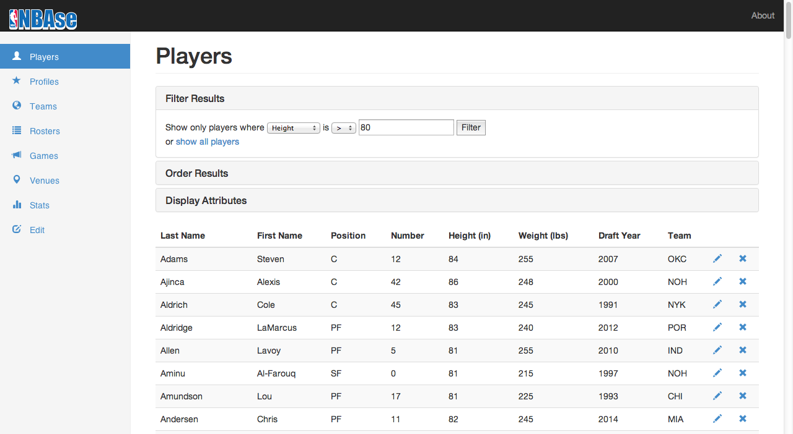
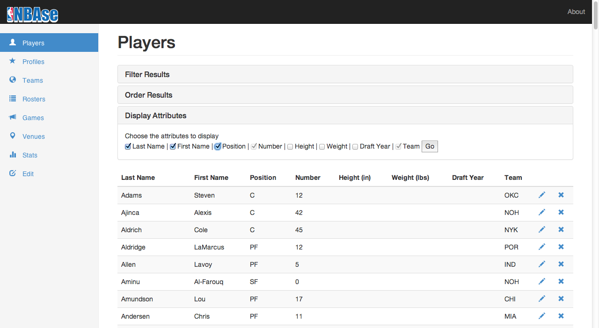
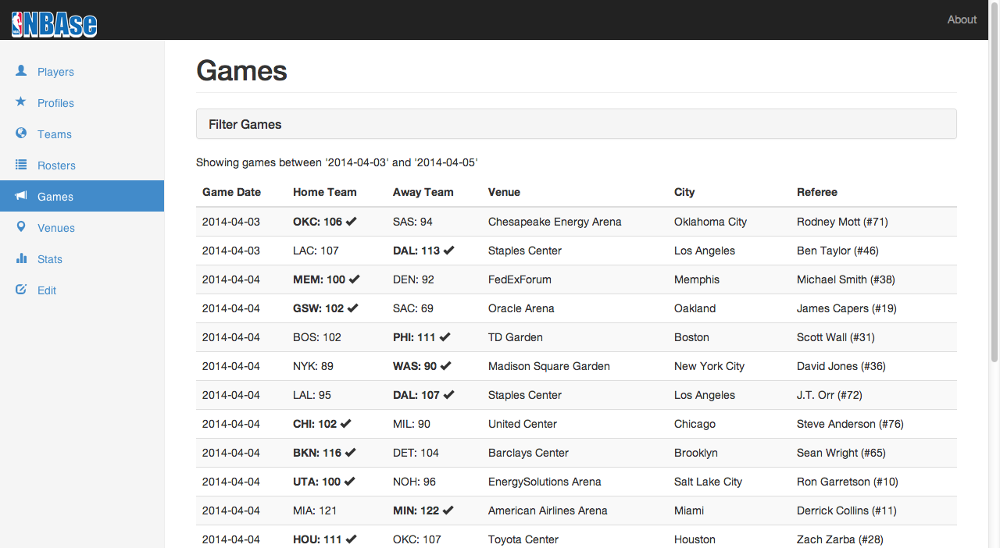
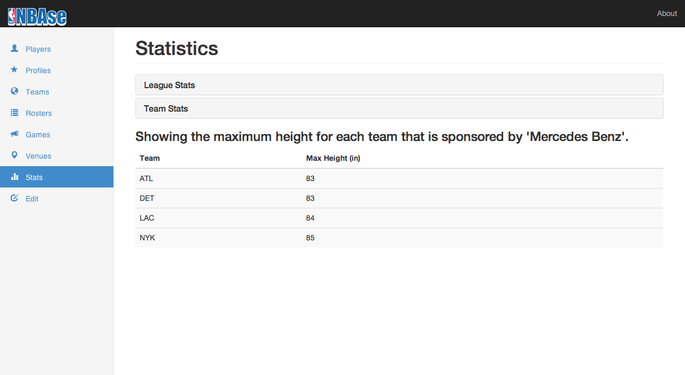
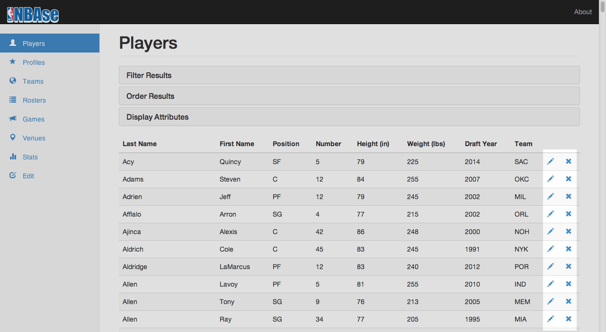
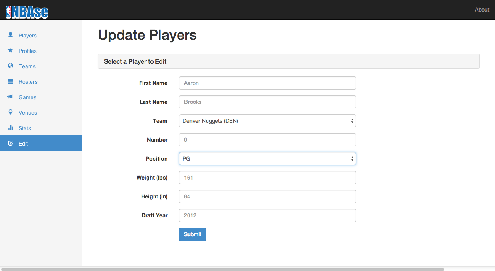

% CPSC 304 Final Project Report
% Jacob Lee; Norman Sue; Daniel Tsang; Marvin Cadano
% June 18, 2014

# Project Description

We are modeled the 2013-2014 NBA league using real data for the most part, and randomly generated data for certain data that we could not easily find.

We are modelled NBA players that play for Teams, along with NBA Staff that work for Teams. Each Team belongs to a Division. Each Team plays a game refereed by an NBA Referee against another Team at a Venue on a particular date. Each Team's Sponsor is also modeled.

User classes include NBA Staff and normal users. Only NBA Staff can modify database information. All other users can only view database information. We did not actually implement any user access control, but included functionality for both user classes in our UI.

## Platforms

- Amazon EC2 virtual server running Ubuntu 12.04.4 LTS
- Apache HTTP Server 2.4
- MySQL 5.5.36
- PHP 5.4.26 (with the PDO extension)

## System functionality

Below is a listing of the specific functionalities we implemented in each of our PHP pages.

### players.php (Jacob)

- Displays a table of all players including information about each player
- Includes an HTML form for choosing attributes (projection), filtering results (selection), and ordering results (order by)
- Includes an option to delete a player

### profiles.php (Jacob)

- Lists all information about a specific player
- Includes a dropdown to select from a list of all players
- Retrieves and displays first Google image result of that player
- Retrieves and dipslays relevant news articles for that player

### teams.php (Marvin)

- Displays a table of all teams including information about each team and their division
- Includes an option to delete a team (deletion should be rejected if team has at least one player)

### rosters.php (Jacob)

- Displays a table of players on a team including information about each player
- Displays a table of staff on a team including information about each staff member
- Displays a table of sponsors for a team
- Includes a dropdown menu to select from a list of all teams

### games.php (Daniel)

- Shows a table of games along with the venue the game was played at and who refereed the game
- Displays an HTML form to only show games between two dates

### stats.php (Jacob)

- Displays an HTML form to pick max/min/average of height, weight, number, draft year stats for ALL players
- Displays an HTML form to pick max/min/average of height, weight, number, draft year stats for players of EACH team where that team is sponsored by a selected company

### update.php (Norman)

- Displays an HTML form to update information about a specific player

### venues.php (Norman)

- Displays a table of all venues
- Displays a table of teams that have played at all venues

# Entity-Relationship Diagram

The only change in our ER diagram (shown in figure \ref{ERdiagram}) since the second project submission was relaxing a full participation constraint on NBAGame and the Referees relationship so that we could demonstrate both a situation where a cascading delete works and one where it doesn't (for the purposes of meeting project demo requirements).


# SQL Table Schemas

No changes were made to the schemas of our SQL tables, which are repeated below for convenience. Only additional `CHECK` constraints were added to the `CREATE TABLE` commands in the included `create_db.sql` script.

Our tables capture all aspects of our ER diagram except for the full participation constraints on NBATeam for the PlaysFor and WorksFor relationships. Furthermore, all tables are in BCNF because no functional dependencies violate BCNF.

## Legend

- `PRIMARY KEY` = **Bold**
- `FOREIGN KEY` = *Italics*
- `PRIMARY KEY` and `FOREIGN KEY` = ***Bold Italics***

## Division

Division(**divisionName**: VARCHAR(10))

```sqlmysql
CREATE TABLE `Division` (
    `divisionName` VARCHAR(10),
    PRIMARY KEY (`divisionName`)
);
```

## Venue

Venue(**venueName**: VARCHAR(30), **city**: VARCHAR(30), address: VARCHAR(50))

```sqlmysql
CREATE TABLE `Venue` (
    `venueName` VARCHAR(30),
    `city` VARCHAR(30),
    `address` VARCHAR(50),
    PRIMARY KEY (`venueName`, `city`)
);
```

## NBATeam_BelongsTo

NBATeam_BelongsTo(**abbreviation**: CHAR(3), city: VARCHAR(30), teamName: VARCHAR(30), *divisionName*: VARCHAR(10))

- *divisionName* `NOT NULL`
- *divisionName* `REFERENCES` Division

```sqlmysql
CREATE TABLE `NBATeam_BelongsTo` (
    `abbreviation` CHAR(3),
    `city` VARCHAR(30),
    `teamName` VARCHAR(30),
    `divisionName` VARCHAR(10) NOT NULL,
    PRIMARY KEY (`abbreviation`),
    FOREIGN KEY (`divisionName`) REFERENCES `Division` (`divisionName`)
);
```

## NBAPlayer_PlaysFor

NBAPlayer_PlaysFor(**number**: INT, position: CHAR(2), firstName: VARCHAR(30), lastName: VARCHAR(30), height: INT, weight: INT, draftYear: YEAR(4), ***team***: CHAR(3))

- ***team*** `NOT NULL`
- ***team*** `REFERENCES` NBATeam_BelongsTo(**abbreviation**) `ON DELETE CASCADE`
- height in inches
- weight in pounds

```sqlmysql
CREATE TABLE `NBAPlayer_PlaysFor` (
    `number` INT,
    `position` CHAR(2),
    `firstName` VARCHAR(30),
    `lastName` VARCHAR(30),
    `height` INT,
    `weight` INT,
    `draftYear` YEAR(4),
    `team` CHAR(3) NOT NULL,
    PRIMARY KEY (`number`, `team`),
    FOREIGN KEY (`team`) REFERENCES `NBATeam_BelongsTo` (`abbreviation`)
        ON DELETE CASCADE,
    CHECK (`draftYear` >= 1946 AND `draftYear` <= YEAR(CURDATE()) AND
        `number` >= 0 AND `number` <= 99 AND
        `height` >= 0 AND `weight` >= 0)
);
```

## NBAStaff_WorksFor

NBAStaff_WorksFor(**firstName**: VARCHAR(30), **lastName**: VARCHAR(30), job: VARCHAR(30), ***team***: CHAR(3))

- ***team*** `NOT NULL`
- ***team*** `REFERENCES` NBATeam_BelongsTo(**abbreviation**) `ON DELETE CASCADE`

```sqlmysql
CREATE TABLE `NBAStaff_WorksFor` (
    `firstName` VARCHAR(30),
    `lastName` VARCHAR(30),
    `job` VARCHAR(30),
    `team` CHAR(3) NOT NULL,
    PRIMARY KEY (`firstname`, `lastname`, `team`),
    FOREIGN KEY (`team`) REFERENCES `NBATeam_BelongsTo` (`abbreviation`)
        ON DELETE CASCADE
);
```

## Sponsor_Endorses

Sponsor_Endorses(**company**: VARCHAR(30), ***team***: CHAR(3))

- ***team*** `NOT NULL`
- ***team*** `REFERENCES` NBATeam_BelongsTo(**abbreviation**) `ON DELETE CASCADE`

```sqlmysql
CREATE TABLE `Sponsor_Endorses` (
    `company` VARCHAR(30),
    `team` CHAR(3) NOT NULL,
    PRIMARY KEY (`company`, `team`),
    FOREIGN KEY (`team`) REFERENCES `NBATeam_BelongsTo` (`abbreviation`)
        ON DELETE CASCADE
);
```

## NBAGame_Plays_PlayedAt

NBAGame_Plays_PlayedAt(**gameDate**: DATE, homeScore: INT, awayScore: INT, ***homeTeam***: CHAR(3), ***awayTeam***: CHAR(3), *venueName*: VARCHAR(30), *city*: VARCHAR(30))

- ***homeTeam*** `NOT NULL`
- ***awayTeam*** `NOT NULL`
- *venueName* `NOT NULL`
- *city* `NOT NULL`
- ***homeTeam*** `REFERENCES` NBATeam_BelongsTo(**abbreviation**) `ON DELETE CASCADE`
- ***awayTeam*** `REFERENCES` NBATeam_BelongsTo(**abbreviation**) `ON DELETE CASCADE`
- *venueName*, *city* `REFERENCES` Venue

```sqlmysql
CREATE TABLE `NBAGame_Plays_PlayedAt` (
    `gameDate` DATE,
    `homeScore` INT,
    `awayScore` INT,
    `homeTeam` CHAR(3) NOT NULL,
    `awayTeam` CHAR(3) NOT NULL,
    `venueName` VARCHAR(30) NOT NULL,
    `city` VARCHAR(30) NOT NULL,
    PRIMARY KEY (`gameDate`, `homeTeam`, `awayTeam`),
    FOREIGN KEY (`homeTeam`) REFERENCES `NBATeam_BelongsTo` (`abbreviation`)
        ON DELETE CASCADE,
    FOREIGN KEY (`awayTeam`) REFERENCES `NBATeam_BelongsTo` (`abbreviation`)
        ON DELETE CASCADE,
    FOREIGN KEY (`venueName`, `city`) REFERENCES `Venue` (`venueName`, `city`),
    CHECK (`gameDate` >= '1946-01-11' AND
        `homeScore` >= 0 AND `awayScore` >= 0)
);
```

## NBAReferee

NBAReferee(**number**: INT, firstName: VARCHAR(30), lastName: VARCHAR(30))

```sqlmysql
CREATE TABLE `NBAReferee` (
    `number` INT,
    `firstName` VARCHAR(30),
    `lastName` VARCHAR(30),
    PRIMARY KEY (`number`),
    CHECK (`number` >= 0 AND `number` <= 99)
);
```

## Referees

Referees(***refNumber***: INT, ***gameDate***: DATE, ***homeTeam***: CHAR(3), ***awayTeam***: CHAR(3))

- ***refNumber*** `REFERENCES` NBAReferee(**number**)
- ***gameDate***, ***homeTeam***, ***awayTeam*** `REFERENCES` NBAGame_Plays_PlayedAt(**gameDate**, ***homeTeam***, ***awayTeam***)

```sqlmysql
CREATE TABLE `Referees` (
    `refNumber` INT,
    `gameDate` DATE,
    `homeTeam` CHAR(3),
    `awayTeam` CHAR(3),
    PRIMARY KEY (`refNumber`, `gameDate`, `homeTeam`, `awayTeam`),
    FOREIGN KEY (`refNumber`) REFERENCES `NBAReferee` (`number`),
    FOREIGN KEY (`gameDate`, `homeTeam`, `awayTeam`)
        REFERENCES `NBAGame_Plays_PlayedAt` (`gameDate`, `homeTeam`, `awayTeam`)
);
```

# SQL Queries

Note that these are only example queries. The attributes in the SELECT clauses and the conditions in the WHERE clauses may vary depending on the user's input.

## Selection and Projection Queries

File location: `players.php`

```sqlmysql
SELECT lastName, firstName, position, number, height, weight, draftYear, team
FROM NBAPlayer_PlaysFor
WHERE height > 80
ORDER BY lastName;
```





## Join Queries

File location: `games.php`

```sqlmysql
SELECT *
FROM NBAGame_Plays_PlayedAt NPP, NBAReferee NR, Referees R
WHERE NR.number = R.refNumber AND 
	  R.gameDate = NPP.gameDate AND 
	  R.homeTeam = NPP.homeTeam AND 
	  R.awayTeam = NPP.awayTeam
ORDER BY npp.gameDate
```



## Division Query

File location: `venues.php`

```sqlmysql
SELECT *
FROM NBATeam_BelongsTo T
WHERE NOT EXISTS
	(SELECT V.venueName
	FROM Venue V
	WHERE NOT EXISTS
		(SELECT DISTINCT G.venueName
		FROM NBAGame_Plays_PlayedAt G
		WHERE V.venueName = G.venueName AND
      			(G.homeTeam = T.abbreviation OR G.awayTeam = T.abbreviation)))
```


## Aggregation Query

File location: `stats.php`

```sqlmysql
SELECT MAX(height) as result
FROM NBAPlayer_PlaysFor
```


## Nested Aggregation with Group-By Query

File location: `stats.php`

```sqlmysql
SELECT team, AVG(draftYear) as result
FROM NBAPlayer_PlaysFor
WHERE team IN
	(SELECT abbreviation
	FROM NBATeam_BelongsTo N, Sponsor_Endorses S
	WHERE N.abbreviation = S.team AND S.company = 'Mercedes Benz')
GROUP BY team
```



## Delete Operation

File location: `delete_team.php`

```sqlmysql
DELETE FROM NBATeam_BelongsTo
WHERE abbreviation = 'TOR'
```


File location: `delete_player.php`

```sqlmysql
DELETE FROM NBAPlayer_PlaysFor
WHERE team = 'DAL' AND number = 41
```



## Update Operation

File location: `update.php`

```sqlmysql
UPDATE NBAPlayer_PlaysFor
SET	firstName = 'Aaron',
	lastName = 'Brooks',
	team = 'DEN',
	number = 0,
	position = PG,
	weight = 161,
	height = 84,
	draftYear = 2012
WHERE team = 'DEN' AND number = 0;
```



## Other Queries and Extra Features

These are miscellaneous queries that were used in the project that were not explicitly required, but included here for completeness.

We also we implemented retrieval of Google Images and Google News articles for each player as shown in the following screenshot.


File location: `venues.php`

```sqlmysql
INSERT INTO Venue
VALUES('Rogers Arena', 'Vancouver', '800 Griffiths Way')
```

File location: `rosters.php`

```sqlmysql
SELECT *
FROM NBAPlayer_PlaysFor
WHERE team = 'TOR';

SELECT *
FROM NBAStaff_WorksFor
WHERE team = 'TOR'
ORDER BY job DESC;

SELECT company
FROM NBATeam_BelongsTo N, Sponsor_Endorses S 
WHERE N.abbreviation = S.team AND team = 'TOR';
```

File location: `teams.php`

```sqlmysql
SELECT city, abbreviation, teamName, divisionName
FROM NBATeam_BelongsTo
```

File location: `update.php`

```sqlmysql
SELECT firstName, lastName, number, team
FROM NBAPlayer_PlaysFor
ORDER BY firstName, lastName;

SELECT *
FROM NBATeam_BelongsTo;

SELECT *
FROM NBAPlayer_PlaysFor
WHERE number = 0 AND team = 'DAL';

SELECT *
FROM NBATeam_BelongsTo
WHERE abbreviation = 'DAL';
```

File location: `forms/rosters_select.php`

```sqlmysql
SELECT abbreviation, teamName, city
FROM NBATeam_BelongsTo
```

File location: `forms/stats_team.php`

```sqlmysql
SELECT DISTINCT company
FROM Sponsor_Endorses
```

# Functional Dependencies

All tables are in BCNF because there are no functional dependencies that violate BCNF.

## Division

No non-trivial functional dependencies were contained in the `Division` table.

## Venue

1. venueName, city -> address
    - Meaning in English: The name of the venue along with the city determines the street address of that venue.

## NBATeam_BelongsTo

1. abbreviation -> city, teamName, divisionName
    - Meaning in English: The 3-letter abbreviation of a team determines the city, team name, and division that the team is in.

2. teamName -> abbreviation, city, divisionName
    - Meaning in English: The team name determines the 3-letter abbreviation, city, and division that the team is in.

## NBAPlayer_PlaysFor

1. number, team -> firstName, lastName, position, height, weight, draftYear
    - Meaning in English: The jersey number and the team of a player determines the full name, position, height, weight, and draft year of that player

## NBAStaff_WorksFor

1. lastName, firstName, team -> job
    - Meaning in English: The full name of a staff member along with the team that they work for determines their job.

## Sponsor_Endorses

No non-trivial functional dependencies were contained in the `Sponsor_Endorses` table.

## NBAGame_Plays_PlayedAt

1. gameDate, homeTeam, awayTeam -> homeScore, awayScore, venueName, city 
    - Meaning in English: The date of the NBA game, along with the home team and away team that played at that game determines the home score, away score, venue name, and city that the game was played at.

2. venueName, city, gameDate -> homeTeam, awayTeam, homeScore, awayScore
    - Meaning in English: The venue name, city, and game date determines the home team, away team, home score, and away score of that game.

## NBAReferee

1. number -> firstName, lastName
    - Meaning in English: The jersey number of a referee determines his or her full name.

## Referees

No non-trivial functional dependencies were contained in the `Referees` table.

# Demo Script

*Note: Times for each section are approximate.*

## Before the demo

* For Norman: Print 3 copies of `project-final-report` which should contain:
    - ER diagram
    - relation instances (table of data)
    - SQL for all queries used in demo
    - SQL for creating tables
- For Norman: Have windows on your laptop open with:
    - Amazon EC2 dashboard
    - Apache HTTP Server config file: `/opt/bitnami/apache2/conf/httpd.cnf`
    - Apache HTTP Server config file: `/opt/bitnami/apache2/conf/bitnami/bitnami.cnf`
    - MySQL config file: `/opt/bitnami/mysql/my.cnf`
    - Terminal to restart `apache` and/or `mysql` with commands:
        - sudo bash ctlscript.sh restart apache
        - sudo bash ctlscript.sh restart mysql

## Setup (2 minutes)

* Run scripts to create and populate database
  * Show TA database instances before and after

## Selection and Projection Query (2 minutes)

* Navigate to **Players** page
  1. From the **Filter Results** menu, specify a selection constraint (any is fine)
  2. Repeat the previous step with a different selection constraint
    * Demonstrate type checking on user input (i.e. input must be a number >= 0)
  3. *Optional*: Order the results by some attribute in the **Order Results** menu
  4. Choose some attributes to display in the **Display Attributes** menu

## Join Query (2 minutes)

* Navigate to **Games** page
  1. Show TA that data has been joined from 4 tables: `nbagame_plays_playedat`, `nbareferee`, and `referees`
  2. If necessary to show a second example, navigate to **Rosters** page and show the list of sponsors for any team
    * This query joins data from 2 tables: `nbateam_belongsto` and `sponsor_endorses`

## Division Query (2 minutes)

* Navigate to **Venues** page
  1. Show TA *Teams that have played at all venues* section (and explain how this is a divison query if necessary)
  2. Add a new venue under the **Add a Venue** menu
  3. Return to **Venues** page, show TA that there are no longer any teams under the *Teams that have played at all venues* section

## Aggregation Query (2 minutes)

* Navigate to **Stats** page
  1. From the **League-Wide** menu, choose an aggregate operator and an attribute
    * Show that this result is consistent with our relation instance
  2. Repeat the previous step with a different operator and attribute
    * Show that this result is consistent with our relation instance

## Nested Aggregation with Group By (2 minutes)

* While still on the **Stats** page
  1. Show TA nested aggregation query on printout
  2. From the **Team-Wide** menu, choose an aggregate operator, an attribute, and a sponsor
    * Show that the results are consistent with our relation instances
  3. Repeat the previous step with different parameters
    * Show that the results are consistent with our relation instances

## Delete Operation (4 minutes)

* Navigate to **Teams** page
  1. Explain the constraints for our tables
    * Deleting a team should delete all players and games that reference that team (`ON DELETE CASCADE`)
    * Cannot delete a game that is referenced by the referees table (`ON DELETE NO ACTION`)
      * Deleting a team should fail if a game has at least one referee
  2. Delete a team that participates in a game with a referee
    * Show that this deletion fails (e.g. show that the team still exists and/or any players & games associated with that team still exist)
    * Show that error message is located in popup box
  3. Delete a team that only participates in games without referees
    * Show that this deletion succeeds (e.g. show that the team is gone from **Teams** page and that there are no players on the **Players** page with that team)

* Navigate to **Players** page
  1. Delete a player from the table (deletion without cascade)

## Update Operation (2 minutes)

* Navigate to **Edit** page
  1. Choose any player to edit
  2. Attempt to change that player's draft year to a year that is greater than the current year
    * Show TA that this update is rejected since it violates a constraint
    * Show that error message is located in popup box
  3. Reattempt to change that player's draft year to a valid year
    * Show that this update succeeded (e.g. navigate to **Players** page and show the player with new draft year)
  4. Show additional type checking for the update form
    * First and Last names must have only alphabet characters and have length >= 1
    * Position is selected from dropdown menu
    * Number must be numeric and have value: 0 <= value <= 99
      * Note: Could also attempt to update player number to a number that already exists on that team (violates primary key constraint)
    * Height must be numeric with value >= 0
    * Weight must be numeric with value >= 0
    * Draft year must be numeric with 1946 <= value <= currentYear
    * Team is selected from dropdown

## Extra Features (2 minutes)

* Navigate to **Players page**
  1. Click on any player from list of players
  2. Show that the page displays unique information from the database about that player
  3. Explain that the profile picture is dynamically retrieved from Google images
  4. Explain that the latest news for each player is dynamically retrieved from Google news
  5. Show the profile page of another (one or more) players
